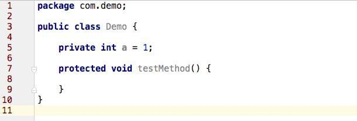
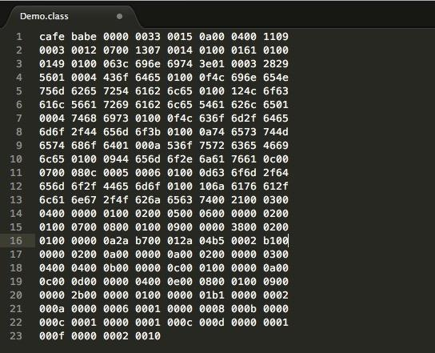
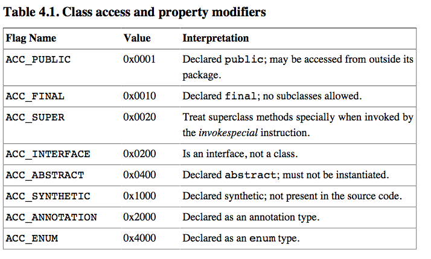
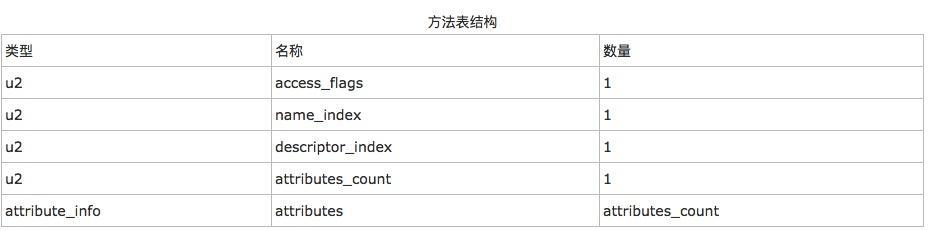
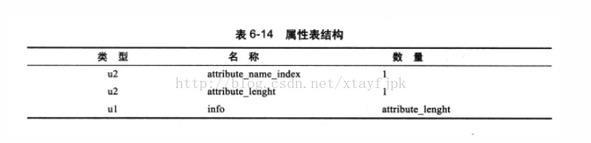
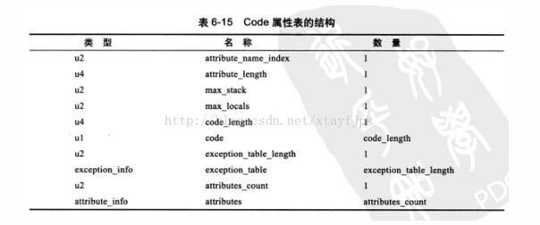
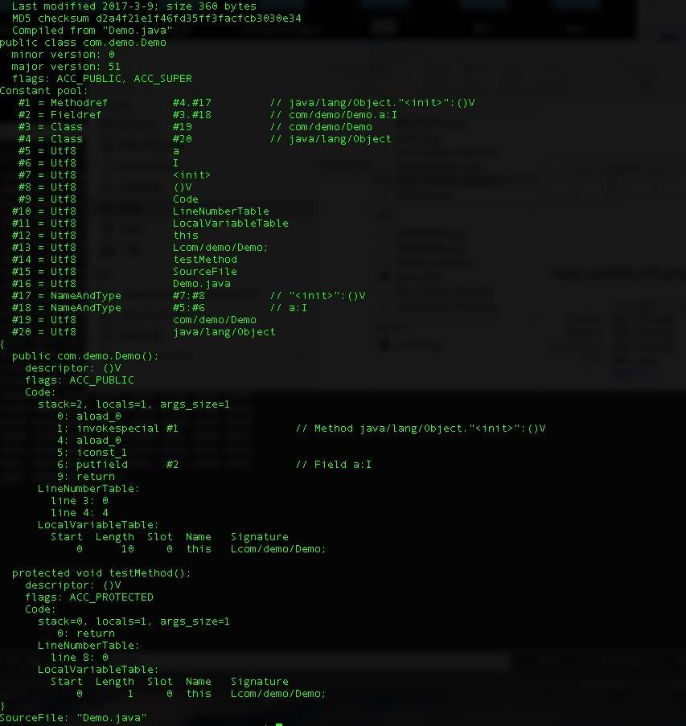

也许你写了无数行的代码，也许你能非常溜的使用高级语言，但是你未必了解那些高级语言的执行过程。例如大行其道的Java。

Java号称是一门“一次编译到处运行”的语言，但是我们对这句话的理解深度又有多少呢？从我们写的java文件到通过编译器编译成java字节码文件（也就是.class文件），这个过程是java编译过程；而我们的java虚拟机执行的就是字节码文件。不论该字节码文件来自何方，由哪种编译器编译，甚至是手写字节码文件，只要符合java虚拟机的规范，那么它就能够执行该字节码文件。那么本文主要讲讲java字节码文件相关知识。接下来我们通过具体的Demo来深入理解：

1 首先我们来写一个java源文件

上面是我们写的一个java程序，很简单，只有一个成员变量a以及一个方法testMethod() 。

2 接下来我们用javac命令或者ide工具将该java源文件编译成java字节码文件。

上图是编译好的字节码文件，我们可以看到一堆16进制的字节。如果你使用IDE去打开，也许看到的是已经被反编译的我们所熟悉的java代码，而这才是纯正的字节码，这也是我们今天需要讲的内容重点。

也许你会对这样一堆字节码感到头疼，不过没关系，我们慢慢试着你看懂它，或许有不一样的收获。在开始之前我们先来看一张图

这张图是一张java字节码的总览图，我们也就是按照上面的顺序来对字节码进行解读的。一共含有10部分，包含魔数，版本号，常量池等等，接下来我们按照顺序一步一步解读。

3.1 魔数

从上面的总览图中我们知道前4个字节表示的是魔数，对应我们Demo的是 0XCAFE BABE。什么是魔数？魔数是用来区分文件类型的一种标志，一般都是用文件的前几个字节来表示。比如0XCAFE BABE表示的是class文件，那么有人会问，文件类型可以通过文件名后缀来判断啊？是的，但是文件名是可以修改的（包括后缀），那么为了保证文件的安全性，将文件类型写在文件内部来保证不被篡改。
从java的字节码文件类型我们看到，CAFE BABE翻译过来是咖啡宝贝之意，然后再看看java图标。

java_icon.jpg

CAFE BABE = 咖啡。

3.2 版本号

我们识别了文件类型之后，接下来要知道版本号。版本号含主版本号和次版本号，都是各占2个字节。在此Demo种为0X0000 0033。其中前面的0000是次版本号，后面的0033是主版本号。通过进制转换得到的是次版本号为0，主版本号为51。
从oracle官方网站我们能够知道，51对应的正式jdk1.7，而其次版本为0，所以该文件的版本为1.7.0。如果需要验证，可以在用java –version命令输出版本号，或者修改编译目标版本–target重新编译，查看编译后的字节码文件版本号是否做了相应的修改。

至此，我们共了解了前8字节的含义，下面讲讲常量池相关内容。

3.3 常量池

紧接着主版本号之后的就是常量池入口。常量池是Class文件中的资源仓库，在接下来的内容中我们会发现很多地方会涉及，如Class Name，Interfaces等。常量池中主要存储2大类常量：字面量和符号引用。字面量如文本字符串，java中声明为final的常量值等等，而符号引用如类和接口的全局限定名，字段的名称和描述符，方法的名称和描述符。

为什么需要类和接口的全局限定名呢？系统引用类或者接口的时候不是通过内存地址进行操作吗？这里大家仔细想想，java虚拟机在没有将类加载到内存的时候根本都没有分配内存地址，也就不存在对内存的操作，所以java虚拟机首先需要将类加载到虚拟机中，那么这个过程设计对类的定位（需要加载A包下的B类，不能加载到别的包下面的别的类中），所以需要通过全局限定名来判别唯一性。这就是为什么叫做全局，限定的意思，也就是唯一性。
在进行具体常量池分析之前，我们先来了解一下常量池的项目类型表：
](img//jvm_constant.jpeg)
jvm_constant.png
上面的表中描述了11中数据类型的结构，其实在jdk1.7之后又增加了3种（CONSTANT_MethodHandle_info,CONSTANT_MethodType_info以及CONSTANT_InvokeDynamic_info)。这样算起来一共是14种。接下来我们按照Demo的字节码进行逐一翻译。

0×0015：由于常量池的数量不固定（n+2），所以需要在常量池的入口处放置一项u2类型的数据代表常量池数量。因此该16进制是21，表示有20项常量，索引范围为1~20。明明是21，为何是20呢？因为Class文件格式规定，设计者就讲第0项保留出来了，以备后患。从这里我们知道接下来我们需要翻译出20项常量。
Constant #1 （一共有20个常量，这是第一个，以此类推…）
0x0a-：从常量类型表中我们发现，第一个数据均是u1类型的tag，16进制的0a是十进制的10，对应表中的MethodRef_info。
0x-00 04-：Class_info索引项#4
0x-00 11-：NameAndType索引项#17
Constant #2
0x-09: FieldRef_info
0×0003 :Class_info索引项#3
0×0012：NameAndType索引项#18
Constant #3
0×07-: Class_info
0x-00 13-: 全局限定名常量索引为#19
Constant #4
0x-07 :Class_info
0×0014:全局限定名常量索引为#20
Constant #5
0×01:Utf-8_info
0x-00 01-:字符串长度为1（选择接下来的一个字节长度转义）
0x-61:”a”(十六进制转ASCII字符)
Constant #6
0×01:Utf-8_info
0x-00 01：字符串长度为1
0x-49:”I”
Constant #7
0×01:Utf-8_info
0x-00 06:字符串长度为6
0x-3c 696e 6974 3e-:”<init>”
Constant #8
0×01 :UTF-8_info
0×0003:字符串长度为3
0×2829 56:”()V”
Constant #9
0x-01:Utf-8_info
0×0004：字符串长度为4
0x436f 6465:”Code”
Constant #10
0×01:Utf-8_info
0×00 0f:字符串长度为15
0x4c 696e 654e 756d 6265 7254 6162 6c65:”LineNumberTable”
Constant #11
ox01: Utf-8_info
0×00 12字符串长度为18
0x-4c 6f63 616c 5661 7269 6162 6c65 5461 626c 65:”LocalVariableTable”
Constant #12
0×01:Utf-8_info
0×0004 字符串长度为4
0×7468 6973 :”this”
Constant #13
0×01:Utf-8_info
0x0f:字符串长度为15
0x4c 636f 6d2f 6465 6d6f 2f44 656d 6f3b:”Lcom/demo/Demo;”
Constant #14
0×01:Utf-8_info
0×00 0a:字符串长度为10
ox74 6573 744d 6574 686f 64:”testMethod”
Constant #15
0×01:Utf-8_info
0x000a:字符串长度为10
0x536f 7572 6365 4669 6c65 :”SourceFile”
Constant #16
0×01:Utf-8_info
0×0009:字符串长度为9
0x-44 656d 6f2e 6a61 7661 :”Demo.java”
Constant #17
0x0c :NameAndType_info
0×0007:字段或者名字名称常量项索引#7
0×0008:字段或者方法描述符常量索引#8
Constant #18
0x0c:NameAndType_info
0×0005:字段或者名字名称常量项索引#5
0×0006:字段或者方法描述符常量索引#6
Constant #19
0×01:Utf-8_info
0×00 0d:字符串长度为13
0×63 6f6d 2f64 656d 6f2f 4465 6d6f:”com/demo/Demo”
Constant #20
0×01:Utf-8_info
0×00 10 :字符串长度为16
0x6a 6176 612f 6c61 6e67 2f4f 626a 6563 74 :”java/lang/Object”
到这里为止我们解析了所有的常量。接下来是解析访问标志位。

3.4 Access_Flag 访问标志

访问标志信息包括该Class文件是类还是接口，是否被定义成public，是否是abstract，如果是类，是否被声明成final。通过上面的源代码，我们知道该文件是类并且是public。

0x 00 21：是0×0020和0×0001的并集。其中0×0020这个标志值涉及到了字节码指令，后期会有专题对字节码指令进行讲解。期待中……

3.5 类索引

类索引用于确定类的全限定名
0×00 03 表示引用第3个常量，同时第3个常量引用第19个常量，查找得”com/demo/Demo”。#3.#19

3.6父类索引

0×00 04 同理：#4.#20(java/lang/Object)

3.7 接口索引

通过java_byte.jpeg图我们知道，这个接口有2+n个字节，前两个字节表示的是接口数量，后面跟着就是接口的表。我们这个类没有任何接口，所以应该是0000。果不其然，查找字节码文件得到的就是0000。

3.8 字段表集合

字段表用于描述类和接口中声明的变量。这里的字段包含了类级别变量以及实例变量，但是不包括方法内部声明的局部变量。
同样，接下来就是2+n个字段属性。我们只有一个属性a，按道理应该是0001。查找文件果不其然是0001。
那么接下来我们要针对这样的字段进行解析。附上字段表结构图

字段表结构.png

0×00 02 ：访问标志为private（自行搜索字段访问标志）
0×00 05 : 字段名称索引为#5，对应的是”a”
0x 00 06 :描述符索引为#6，对应的是”I”
0x 00 00 :属性表数量为0，因此没有属性表。
tips:一些不太重要的表（字段，方法访问标志表）可以自行搜索，这里就不贴出来了，防止篇幅过大。

3.9 方法

我们只有一个方法testMethod，按照道理应该前2个字节是0001。通过查找发现是0×00 02。这是什么原因，这代表着有2个方法呢？且继续看……

上图是一张方法表结构图，按照这个图我们分析下面的字节码：

第1个方法：

0×00 01：访问标志 ACC_PUBLIC，表明该方法是public。（可自行搜索方法访问标志表）
0×00 07：方法名索引为#7，对应的是”<init>”
0×00 08：方法描述符索引为#8，对应的是”()V”
0×00 01：属性表数量为1(一个属性表)
那么这里涉及到了属性表。什么是属性表呢？可以这么理解，它是为了描述一些专有信息的，上面的方法带有一张属性表。所有属性表的结构如下图：
一个u2的属性名称索引，一个u2的属性长度加上属性长度的info。
虚拟机规范预定义的属性有很多，比如Code，LineNumberTable，LocalVariableTable，SourceFile等等，这个网上可以搜索到。

属性表结构.jpg

按照上面的表结构解析得到下面信息：
0×0009:名称索引为#9(“Code”)。
0×000 00038：属性长度为56字节。
那么接下来解析一个Code属性表，按照下图解析

code.jpg

前面6个字节（名称索引2字节+属性长度4字节）已经解析过了，所以接下来就是解析剩下的56-6=50字节即可。
0×00 02 ：max_stack=2
0×00 01 : max_locals=1
0×00 0000 0a : code_length=10
0x2a b700 012a 04b5 0002 b1 : 这是code代码，可以通过虚拟机字节码指令进行查找。
2a=aload_0(将第一个引用变量推送到栈顶)
b7=invokespecial(调用父类构造方法)
00=什么都不做
01 =将null推送到栈顶
2a=同上
04=iconst_1 将int型1推送到栈顶
b5=putfield 为指定的类的实例变量赋值
00= 同上
02=iconst_m1 将int型-1推送栈顶
b1=return 从当前方法返回void
整理，去除无动作指令得到下面
0 : aload_0
1 : invokespecial
4 : aload_0
5 : iconst_1
6 : putfield
9 : return
关于虚拟机字节码指令这块内容，后期会继续深入下去…… 目前只需要了解即可。接下来顺着Code属性表继续解析下去:
0×00 00 : exception_table_length=0
0×00 02 : attributes_count=2(Code属性表内部还含有2个属性表)
0×00 0a: 第一个属性表是”LineNumberTable”

LineNumberTable.jpg

0×00 0000 0a : “属性长度为10″
0×00 02 ：line_number_table_length=2
line_number_table是一个数量为line_number_table_length，类型为line_number_info的集合，line_number_info表包括了start_pc和line_number两个u2类型的数据项，前者是字节码行号，后者是Java源码行号
0×00 00 : start_pc =0
0×00 03 : end_pc =3
0×00 04 : start_pc=4
0×00 04 : end_pc=4

0×00 0b 第二个属性表是：”LocalVariableTable”

local_variable_table.png

dl_variable_info.png

0×00 0000 0c：属性长度为12
0×00 01 : local_variable_table_length=1
然后按照local_variable_info表结构进行解析：
0×00 00 : start_pc=0
0×00 0a：length=10
0x000c : name_index=”this”
0x000d : descriptor_index #13 (“Lcom/demo/Demo”)
0000 index=0
//——-到这里第一个方法就解析完成了——-//
Method（<init>)–1个属性Code表-2个属性表（LineNumberTable ，LocalVariableTable）接下来解析第二个方法

第2个方法：

0×00 04：”protected”
0×00 0e: #14（”testMethod”）
0×00 08 : “()V”
0×0001 ： 属性数量=1
0×0009 ：”Code”
0×0000 002b 属性长度为43
解析一个Code表
0000 :max_stack =0
0001 : max_local =1
0000 0001 : code_length =1
0xb1 : return(该方法返回void)
0×0000 异常表长度=0
0×0002 属性表长度为2
//第一个属性表
0x000a : #10，LineNumberTable
0×0000 0006 : 属性长度为6
0×0001 : line_number_length = 1
0×0000 : start_pc =0
0×0008 : end_pc =8
//第二个属性表
0x000b : #11 ，LocalVariableTable
0×0000 000c : 属性长度为12
0×0001 : local_variable_table_length =1
0×0000 :start_pc = 0
0×0001: length = 1
0x000c : name_index =#12 “this”
0x000d : 描述索引#13 “Lcom/demo/Demo;”
0000 index=0

//到这里为止，方法解析都完成了，回过头看看顶部解析顺序图，我们接下来就要解析Attributes了。

3.10 Attribute

0×0001 ：同样的，表示有1个Attributes了。
0x000f : #15(“SourceFile”)
0×0000 0002 attribute_length=2
0×0010 : sourcefile_index = #16(“Demo.java”)
SourceFile属性用来记录生成该Class文件的源码文件名称。

source_file.jpeg

4 另话

其实，我们写了这么多确实很麻烦，不过这种过程自己体验一遍的所获所得还是不同的。现在，使用java自带的反编译器来解析字节码文件。
javap -verbose Demo //不用带后缀.class

javap_result.jpg
